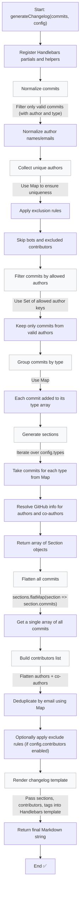

```mermaid
flowchart TD

A["Start: generateChangelog(commits, config)"] --> B["Register Handlebars partials and helpers"]

B --> C["Normalize commits"]
C:::stepDesc -->|"Filter only valid commits (with author and type)"| C1["Normalize author names/emails"]

C1 --> D["Collect unique authors"]
D:::stepDesc -->|"Use Map<name|email, author> to ensure uniqueness"| D1["Apply exclusion rules"]
D1 --> D2["Skip bots and excluded contributors"]

D2 --> E["Filter commits by allowed authors"]
E:::stepDesc -->|"Use Set of allowed author keys"| E1["Keep only commits from valid authors"]

E1 --> F["Group commits by type"]
F:::stepDesc -->|"Use Map<type, GitCommit[]>"| F1["Each commit added to its type array"]

F1 --> G["Generate sections"]
G:::stepDesc -->|"Iterate over config.types"| G1["Take commits for each type from Map"]
G1 --> G2["Resolve GitHub info for authors and co-authors"]
G2 --> G3["Return array of Section objects"]

G3 --> H["Flatten all commits"]
H:::stepDesc -->|"sections.flatMap(section => section.commits)"| H1["Get a single array of all commits"]

H1 --> I["Build contributors list"]
I:::stepDesc -->|"Flatten authors + co-authors"| I1["Deduplicate by email using Map"]
I1 --> I2["Optionally apply exclude rules (if config.contributors enabled)"]

I2 --> J["Render changelog template"]
J:::stepDesc -->|"Pass sections, contributors, tags into Handlebars template"| J1["Return final Markdown string"]

J1 --> K["End ✅"]

classDef stepDesc fill:#f7f9fa,stroke:#b0b0b0,color:#333,stroke-width:1px;

```
